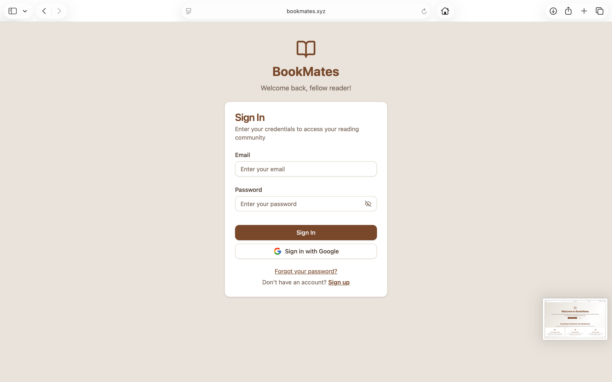
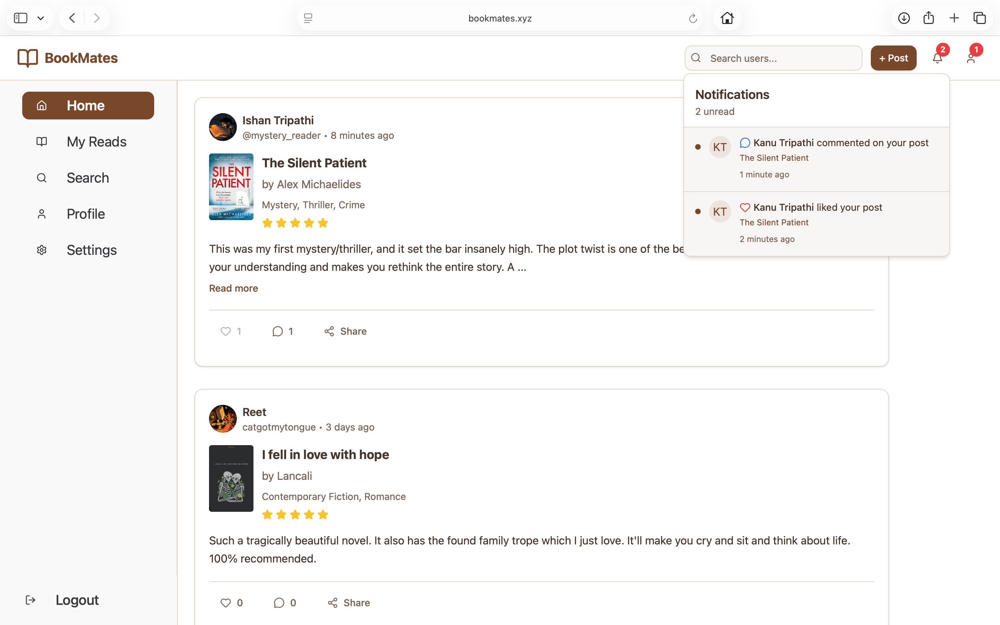
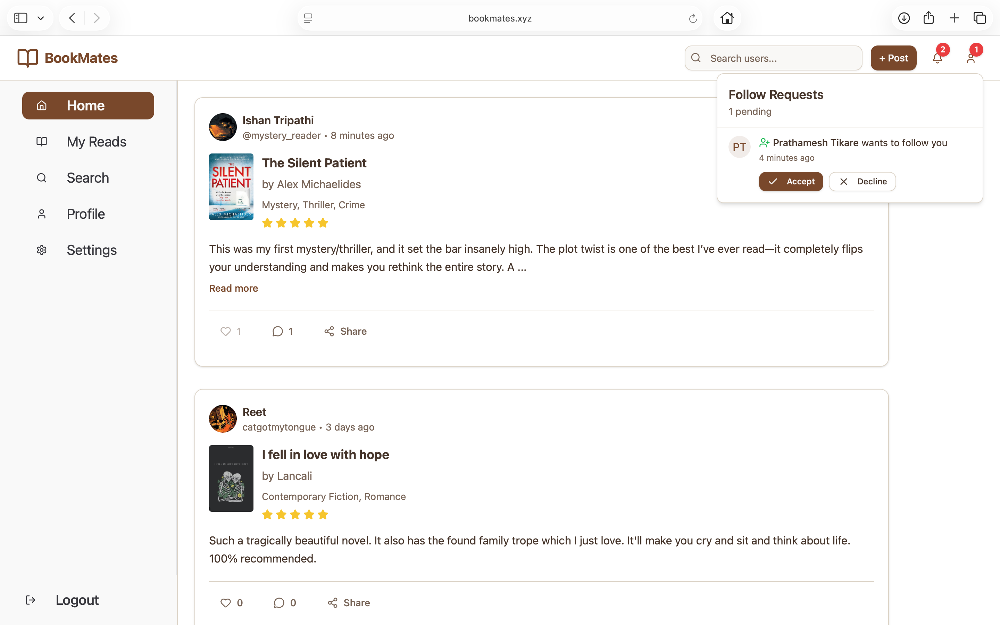
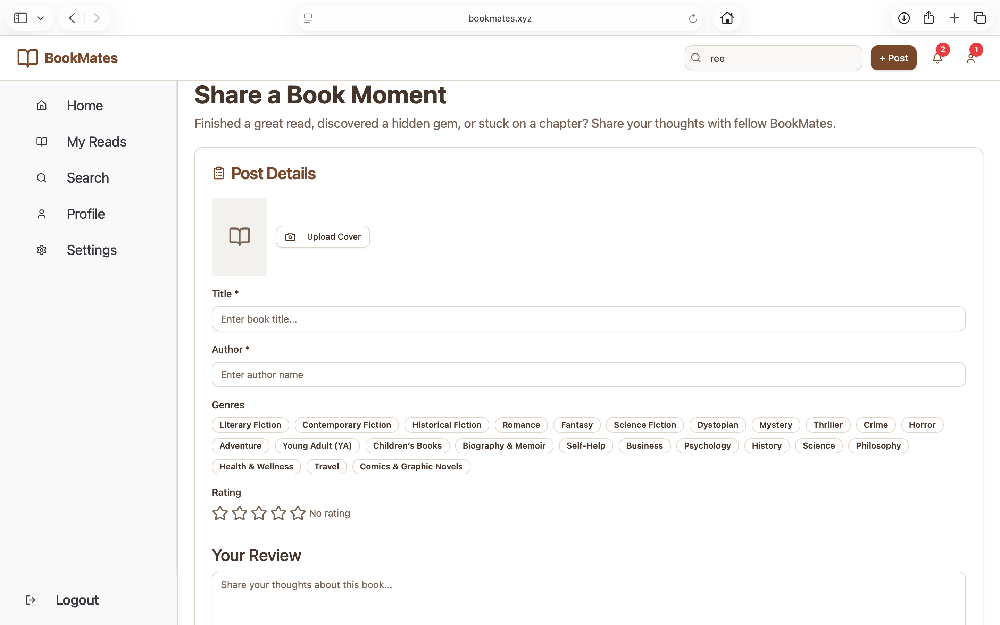
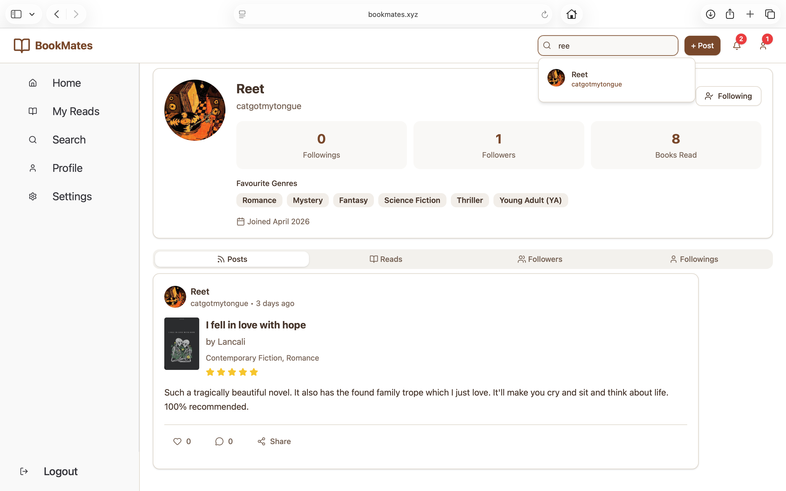
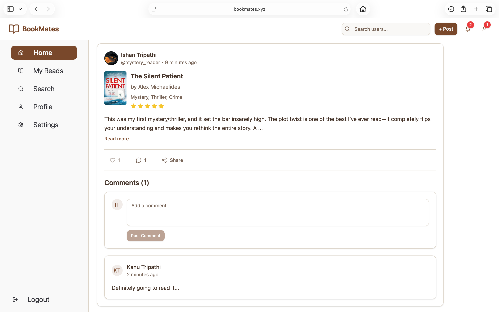
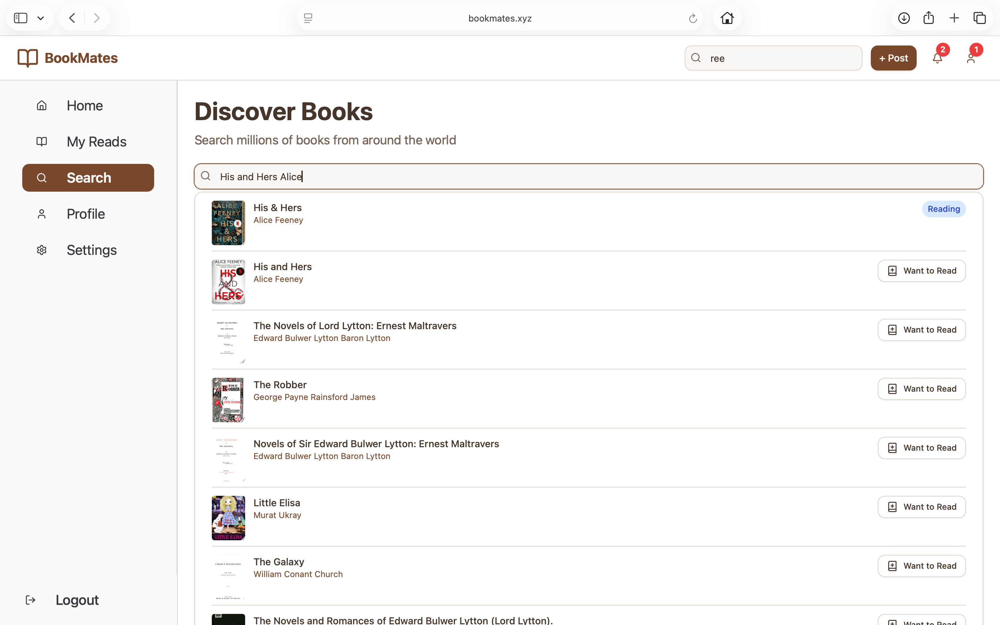
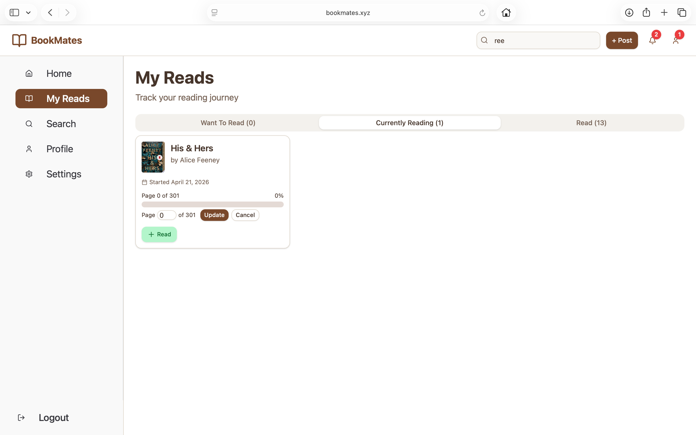

# BookMates — Social Platform for Book Readers

🌐 Live: https://bookmates.xyz  

---

## Overview

BookMates is a full-stack social platform designed for book enthusiasts to track their reading journey, share reviews, and interact with other readers.

The platform enables users to:
- 📚 Share book reviews and ratings  
- 👥 Follow other readers (public/private profiles)  
- ❤️ Like and 💬 comment on posts  
- 🔔 Receive notifications  
- 📖 Track reading progress (Read / Reading / Want to Read)  
- 🔍 Discover books and users  

The system is built with a focus on **scalability, performance, and real-world workflows**.

---

## 📸 Screenshots

### 🏠 Landing Page

  

---

### 🔐 Authentication (Login)

  

---

### 📰 Feed with Notifications

  

---

### 👥 Feed with Follow Requests

  

---

### ✍️ Create Post

  

---

### 👤 Profile

  

---

### 💬 Comments

  

---

### 🔍 Search Books

  

---

### 📖 Reading Tracker

  

---

## Key Features

### 👤 Authentication & Authorization
- Email/password authentication  
- Google OAuth login  
- JWT-based session management  
- Account linking (Google + normal signup)  
- Protected routes (frontend + backend)  

---

### 📰 Feed System
- Personalized feed (**self + following users**)  
- Cursor-based pagination using `createdAt + _id`  
- Infinite scrolling with `hasMore` flag  
- Fetches 20 posts per request  

---

### ❤️ Likes & 💬 Comments
- Separate collections for likes and comments  
- Duplicate likes prevented  
- Optimistic UI updates  
- Lazy-loaded and paginated comments  

---

### 🔔 Notifications
- Separate notification collection  
- Triggered on likes, comments, follow requests  
- Read/unread tracking with count  

---

### 👥 Follow System
- Public → direct follow  
- Private → follow request (accept/reject)  
- Followers & followings stored in user  
- Consistency via `$addToSet` and `$pull`  

---

### 🔍 Search
**User Search**
- Debounced input  
- AbortController to cancel stale requests  

**Book Search**
- Google Books API integration  
- Debounced API calls  

---

### 📖 Reading Tracker
- Separate `Read` collection  
- Status: Read / Reading / Want to Read  
- Progress tracking  
- Optimistic updates  

---

### 📝 Post Creation
- Fields: title, author, genres, rating, review, cover image  
- Image upload via AWS S3  
- Loader during upload  

---

### ⚙️ Profile & Settings
- Update avatar, bio, genres, password  
- Toggle public/private profile  
- Account deletion with password verification  

---

## Key Engineering Decisions

- **Cursor-Based Pagination**  
- **Normalized Database Design**  
- **Denormalized Counters**  
- **Optimistic UI Updates**  
- **Lazy Loading**  
- **Debounced Search + AbortController**  
- **Robust Error Handling**
    
---

## Deployment

- **Frontend:** Vercel  
- **Backend:** AWS EC2  
- **Media Storage:** AWS S3  
- **Database:** MongoDB Atlas  
- **Domain:** https://bookmates.xyz  

---

## Future Features

- Real-time notifications (WebSockets)  
- Recommendation system
- Real-time chat system   

---

## Tech Stack

### Frontend
- React.js  
- Tailwind CSS  
- ShadCN UI  

### Backend
- Node.js  
- Express.js  

### Database
- MongoDB (Mongoose)  

### Cloud
- AWS EC2  
- AWS S3  
- Vercel  
